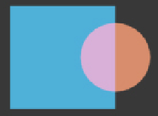

# Unity Shader 笔记

## GPU流水线

### GPU渲染流程图

<br>*▲ 颜色表示了不同阶段的可配置性或可编程性：绿色表示该流水线阶段是完全可编程控制的，黄色表示该流水线阶段可以配置但不是可编程的，蓝色表示该流水线阶段是由GPU固定实现的，开发者没有任何控制权。实线表示该Shader必须由开发者编程实现，虚线表示该Shader是可选的*</img>

### 顶点着色器（Vertex Shader）

顶点着色器需要完成的工作主要有： **[坐标变换](#坐标变换)** 和 **[逐顶点光照](#逐顶点光照)** 。

#### 坐标变换

一个最基本的顶点着色器必须完成的一个工作是： **把顶点坐标从模型空间转换到齐次裁剪空间** 。

##### 这是 Unity 内置渲染管线中的部分代码

```cpp
#include "UnityCG.cginc"

// 标准写法
o.pos = mul(UNITY_MVP，v.position);

// 更高效的写法
o.pos = mul(UNITY_MATRIX_VP, mul(unity_ObjectToWorld, float4(v.position, 1.0)));

// 直接调用 Unity 函数
o.pos = UnityObjectToClipPos(v.position)
```

##### 这是 Unity URP 中的部分代码

```cpp
#include "Packages/com.unity.render-pipelines.universal/ShaderLibrary/Core.hlsl"

o.pos = TransformObjectToHClip(v.position);
```

#### 逐顶点光照

***Todo***: 待学习

### 裁剪（Clipping）

<br>*▲ 只有在单位立方体的图元才需要被继续处理。因此，完全在单位立方体外部的图元（红色三角形）被舍弃，完全在单位立方体内部的图（绿色三角形）将被保留。和单位立方体相交的图元（黄色三角形）会被裁剪，新的顶点会被生成，原来在外部的顶点会被舍弃。*</img>

**裁剪** 是硬件上的固定操作，但我们可以自定义一个裁剪操作来对这一步进行配置。

### 屏幕映射（Screen Mapping）

屏幕映射（Screen Mapping）的任务是把每个图元的x和y坐标转换到屏幕坐标系（Screen Coordinates）下。屏幕坐标系是一个二维坐标系，它和我们用于显示画面的分辨率有很大关系。\
*注意：* OpenGL把屏幕的左下角当成最小的窗口坐标值，而DirectX则定义了屏幕的左上角为最小的窗口坐标值。

### 三角形设置（Triangle Setup）

这个阶段会计算光栅化一个三角网格所需的信息。它的输出是为了给下一个阶段做准备。

### 三角形遍历（Triangle Traversal）

这个阶段将会检查每个 **像素** 是否被一个三角网格所覆盖。如果被覆盖的话，就会生成一个 **片元**（fragment）。
而这样一个找到哪些像素被三角网格覆盖的过程就是三角形遍历，这个阶段也被称为扫描变换（Scan Conversion）

<br>*▲ 根据几何阶段输出的顶点信息，最终得到该三角网格覆盖的像素位置。对应像素会生成一个片元，而片元中的状态是对3个顶点的信息进行插值得到的。例如，上图中3个顶点的深度进行插值得到其重心位置对应的片元的深度值为-10.0*</img>

这一步的输出就是得到一个片元序列。需要注意的是，一个片元并不是真正意义上的像素，而是包含了很多状态的集合，这些状态用于计算每个像素的最终颜色。这些状态包括了（但不限于）它的屏幕坐标、深度信息，以及其他从几何阶段输出的顶点信息，例如法线、纹理坐标等。

### 片元着色器（Fragment Shader）

在DirectX中，片元着色器被称为像素着色器（Pixel Shader）。\
片元着色器的输入是上一个阶段对顶点信息插值得到的结果，更具体来说，是根据那些从顶点着色器中输出的数据插值得到的。而它的输出是一个或者多个颜色值。\
这一阶段可以完成很多重要的渲染技术，其中最重要的技术之一就是纹理采样。为了在片元着色器中进行[纹理采样](#纹理采样texture-sampling)，我们通常会在顶点着色器阶段输出每个顶点对应的纹理坐标，然后经过光栅化阶段对三角网格的3个顶点对应的纹理坐标进行插值后，就可以得到其覆盖的片元的纹理坐标了。\
它的局限在于，它仅可以影响单个片元。也就是说，当执行片元着色器时，它不可以将自己的任何结果直接发送给它的邻居们。\

### 逐片元操作

逐片元操作（Per-Fragment Operations）是OpenGL中的说法，在DirectX中，这一阶段被称为输出合并阶段（Output-Merger）。\
这一阶段有几个主要任务。

1. 决定每个片元的可见性。这涉及了很多测试工作，例如[深度测试](#深度测试depth-test流程)、[模板测试](#模板测试stencil-test流程)等。
2. 如果一个片元通过了所有的测试，就需要把这个片元的颜色值和已经存储在颜色缓冲区中的颜色进行合并，或者说是[混合](#混合blend流程)。

<br>*▲ 逐片元操作阶段所做的操作。只有通过了所有的测试后，新生成的片元才能和颜色缓冲区中已经存在的像素颜色进行混合，最后再写入颜色缓冲区中。*</img>

#### 模板测试和深度测试

<br>*▲ 模板测试和深度测试的简化流程图。注意他们在测试失败后的不同流程。*</img>

##### 模板测试（Stencil Test）流程

与之相关的是[Stencil 命令](#stencil-命令详解)。

如果开启了模板测试，GPU会首先读取（使用读取掩码）模板缓冲区中该片元位置的模板值，然后将该值和读取（使用读取掩码）到的参考值（reference value）进行比较，这个比较函数可以是由开发者指定的，例如小于时舍弃该片元，或者大于等于时舍弃该片元。如果这个片元没有通过这个测试，该片元就会被舍弃。不管一个片元有没有通过模板测试，我们都可以根据模板测试和下面的深度测试结果来修改模板缓冲区，这个修改操作也是由开发者指定的。开发者可以设置不同结果下的修改操作，例如，在失败时模板缓冲区保持不变，通过时将模板缓冲区中对应位置的值加1等。模板测试通常用于限制渲染的区域。另外，模板测试还有一些更高级的用法，如渲染阴影、轮廓渲染等。

如果一个片元通过了模板测试，那么它会进行下一个测试——深度测试（Depth Test）。

##### 深度测试（Depth Test）流程

如果开启了深度测试，GPU会把该片元的深度值和已经存在于深度缓冲区中的深度值进行比较。这个比较函数也是可由开发者设置的，例如小于时舍弃该片元，或者大于等于时舍弃该片元。通常这个比较函数是小于等于的关系，即如果这个片元的深度值大于等于当前深度缓冲区中的值，那么就会舍弃它。这是因为，我们总想只显示出离摄像机最近的物体，而那些被其他物体遮挡的就不需要出现在屏幕上。如果这个片元没有通过这个测试，该片元就会被舍弃。

和模板测试有些不同的是，如果一个片元没有通过深度测试，它就没有权利更改深度缓冲区中的值。而如果它通过了测试，开发者还可以指定是否要用这个片元的深度值覆盖掉原有的深度值，这是通过开启/关闭深度写入来做到的。

透明效果和深度测试以及深度写入的关系非常密切。

如果一个片元通过了上面的所有测试，它就可以来到混合功能的面前。

#### 混合（Blend）流程

<br>*▲ 混合操作的简化流程图*</img>

混合操作也是可以高度配置的：开发者可以选择开启/关闭混合功能。\
如果没有开启混合功能，就会直接使用片元的颜色覆盖掉颜色缓冲区中的颜色。那么就无法得到透明效果。\
如果开启了混合，GPU会取出源颜色和目标颜色，将两种颜色进行混合。源颜色指的是片元着色器得到的颜色值，而目标颜色则是已经存在于颜色缓冲区中的颜色值。之后，就会使用一个混合函数来进行混合操作。

更详细的解释参考 ***ToDo***：添加后面关于混合的链接

## Shader 概述

### 材质（Material）和Unity Shader

总体来说，在Unity中我们需要配合使用材质（Material）和Unity Shader才能达到需要的效果。一个最常见的流程是：

1. 创建一个材质；
2. 创建一个Unity Shader，并把它赋给上一步中创建的材质；
3. 把材质赋给要渲染的对象；
4. 在材质面板中调整Unity Shader的属性，以得到满意的效果。

### Unity Shader 模板

#### Standard Surface Shader

一个包含了标准光照模型的表面着色器模板

#### Unlit Shader

一个不包含光照（但包含雾效）的基本的顶点/片元着色器

#### Image Effect Shader

为实现各种屏幕后处理效果提供了一个基本模板。

#### Compute Shader

这类Shader旨在利用GPU的并行性来进行一些与常规渲染流水线无关的计算，暂时不管。

#### Ray Tracing Shader

光线追踪，暂时不管。

### Unity Shader的结构

一个Unity Shader的基础结构如下所示：

```text
Shader "ShaderName" {
　　Properties {
　　　　// 属性
　　}
　　SubShader {
　　　　// 显卡A使用的子着色器
　　}
　　SubShader {
　　　　// 显卡B使用的子着色器
　　}　　
　　Fallback "VertexLit"
}
```

### Shader 名称

每个Unity Shader文件的第一行都需要通过Shader语义来指定该Unity Shader的名字。这个名字由一个字符串来定义，例如“MyShader”。\
当为材质选择使用的Unity Shader时，这些名称就会出现在材质Inspector的下拉列表里。\
通过在字符串中添加斜杠（“/”），可以控制Unity Shader在材质Inspector中出现的位置。例如：Shader "Custom/MyShader" {　　 }

### Shader Properties

Properties 是材质和Unity Shader的桥梁

Properties语义块的定义通常如下：

```text
Properties {
　　[optional: attribute] name("display text in Inspector", type name) = default value
　　[optional: attribute] name("display text in Inspector", type name) = default value
　　// 更多属性
}
```

开发者们声明这些属性是为了在材质Inspector中能够方便地调整各种材质属性。\
如果我们需要在Shader中访问它们，就需要使用每个属性的名称（name）。**在Unity中，这些属性的名称通常由一个下划线开始。**\
显示的名称（display text in Inspector）则是出现在材质Inspector上的名称。\
我们需要为每个属性指定它的类型（type name）\
除此之外，我们还需要为每个属性指定一个默认值（default value），在我们第一次把该Unity Shader赋给某个材质时，材质Inspector上显示的就是这些默认值。

***ToDo***：完善属性和Shader代码之间的联系。

***注意：***

- 即使不在Properties语义块中声明这些属性，也可以直接在Shader代码片中定义变量。无论属性是否存在于Properties语义块中，都可以通过 C# 脚本（使用同样的方法）向Shader传递这些属性。

- 如果设置了属性， Shader Pass 中的变量名必须和属性名相同。同样的，通过 C# 脚本向 Shader 传递属性时，使用的属性名也必须和 Pass 中的变量名相同。

#### 属性类型

常见的属性类型如下表所示

| 属性类型 | 例子 | 备注 |
| :--- | :--- | :--- |
| Integer | _MyInteger ("My Integer", Integer) = 1 | 这是真正的整型，而不是像 Int 那样实际使用了浮点数。 |
| Int(legacy) | _MyInt("My Integer", Int) = 1 | 实际使用了浮点数。如果需要整型推荐使用 Integer 类型。 |
| Float | _MyFloat("My Float", Float) = 1.0 | 在 Shader 代码中，对应  float, half 或 fixed 类型。 |
| Range | _MyRange("My Range", Range(0.0, 1.0)) = 0.5 | <li>在 Shader 代码中，对应  float, half 或 fixed 类型。<li>范围的最大最小值均包含在内。 |
| Color | _MyColor("My Color", Color) = (.25, .5, .5, 1) | <li>在 Shader 代码中，对应 float4, half4 或 fixed4 类型。<li>在Inspector中默认使用颜色工具，如果需要手动输入数值，使用 Vector 类型。 |
| Vector | _MyVector("My Vector", Vector) = (.25, .5, .5, 1) | 在 Shader 代码中，对应 float4, half4 或 fixed4 类型。 |
| Texture2D | _MyTexture2D("My Texture2D", 2D) = "" {}<br>_MyTexture2D("My Texture2D", 2D) = "red" {} | <li>在 Shader 代码中，对应 sampler2D 类型。<li>Unity 支持以下字符串来使用内置材质:<br>“white” (RGBA: 1,1,1,1)<br>“black” (RGBA: 0,0,0,1)<br>“gray” (RGBA: 0.5,0.5,0.5,1)<br>“bump” (RGBA: 0.5,0.5,1,0.5)<br>“red” (RGBA: 1,0,0,1)<li>如果字符串留空或不正确，则默认使用"gray"<li>这些默认材质在Inspector中是不可见的。 |
| Texture3D | _MyTexture3D("My Texture3D", 3D) = "" {}<br>_MyTexture3D("My Texture3D", 3D) = "white" {} | <li>在 Shader 代码中，对应 sampler3D 类型。<li>字符串内容同 Texture2D |
| Cubemap | _MyCubemap ("My Cubemap", Cube) = "" {}<br>_MyCubemap ("My Cubemap", Cube) = "black" {} | <li>在 Shader 代码中，对应 samplerCUBE 类型。<li>字符串内容同 Texture2D |
| Texture2DArray | _MyTexture2DArray ("My Texture2D Array", 2DArray) = "" {} | 参考<a href="https://docs.unity3d.com/Manual/class-Texture2DArray.html" target="_blank">Unity 文档</a> |
| CubemapArray | _MyCubemapArray ("My Cubemap Array", CubeArray) = "" {} | 参考<a href="https://docs.unity3d.com/Manual/class-CubemapArray.html" target="_blank">Unity 文档</a> |

#### 常见的属性装饰（Attribute）

可选的装饰（Attribute）用来控制属性在Inspector中的显示方式。

常见的 Attribute 如下表所示

| Attribute | 说明 |
| :--- | :--- |
| \[Gamma] | <li>指示浮点或矢量属性使用 sRGB 值，这意味着如果项目中的颜色空间需要，它必须与其他 sRGB 值一起转换。<li> *没有找到具体用法。* |
| \[HDR] | <li>指示纹理或颜色属性使用 <a href="https://docs.unity3d.com/Manual/HDR.html" target="_blank">HDR</a> 值。<li>对于纹理属性，如果分配了 LDR 纹理，Unity 编辑器会显示警告。<li>对于颜色属性，Unity Editor 使用 HDR 颜色选择器来编辑此值。 |
| \[HideInInspector] | 在 Inspector 窗口中隐藏这个属性。 |
| \[MainTexture] | <li>设置材质的主纹理，可以在 C# 脚本中使用 <a href="https://docs.unity3d.com/ScriptReference/Material-mainTexture.html" target="_blank">Material.mainTexture</a> 访问它。<li>默认情况下，Unity 将属性名称为 `_MainTex` 的纹理视为主纹理。如果主纹理具有不同的属性名称，而且希望 Unity 将其视为主纹理，必须使用这个 Attribute 。<li>如果多次使用这个 Attribute ，Unity 将使用第一个属性并忽略后续属性。<li> *注意：* 如果使用此 Attribute 设置主纹理，在使用纹理流调试视图模式（texture streaming debugging view mode）或自定义调试工具时，纹理在 Game view 中不可见。 |
| \[MainColor] | <li>设置材质的主要颜色，可以在 C# 脚本中使用 <a href="https://docs.unity3d.com/ScriptReference/Material-color.html" target="_blank">Material.color</a> 访问它。<li>默认情况下，Unity 将属性名称为 `_Color` 的颜色视为主颜色。如果主颜色具有不同的属性名称，而且希望 Unity 将其视为主颜色，必须使用这个 Attribute 。如果多次使用这个 Attribute ，Unity 将使用第一个属性并忽略后续属性。 |
| \[NoScaleOffset] | <li>在 Inspector 窗口中藏此纹理的[缩放和偏移](#%E7%BA%B9%E7%90%86%E7%BC%A9%E6%94%BEtilling%E5%92%8C%E7%BA%B9%E7%90%86%E5%81%8F%E7%A7%BBoffset)。<li>依然可以在 Shader 和 C# 代码中访问及修改纹理的缩放和偏移
| \[Normal] | <li>指示纹理属性需要法线贴图。<li>如果分配不兼容的纹理，Unity 编辑器会显示警告。 |
| \[PerRendererData] | <li>指示纹理属性将来自每个渲染器数据，形式为 MaterialPropertyBlock 。<li>在 Inspector 窗口中这些属性为只读。<li>*暂时不管*

#### 其他的属性装饰（Attribute）

其他的 Attribute 如下：

##### Toggle

启用或禁用单个 [着色器关键字（Shader Keyword）](#着色器关键字shader-keyword) 。它使用一个浮点数变量来存储着色器关键字的状态，并将其显示为一个开关。启用开关时，Unity 启用着色器关键字，对应的变量为 True ；禁用开关时，Unity 会禁用着色器关键字，对应的变量为 False 。

如果指定关键字名称，则切换会影响具有该名称的 Shader 关键字。如果未指定着色器关键字名称，则切换会影响名称为 `(uppercase property name)_ON` 的着色器关键字。

```cpp
// 这个例子指定了关键字名称。
// 启用开关时, Unity 启用名称为 "ENABLE_EXAMPLE_FEATURE" 的着色器关键字，对应 _ExampleFeatureEnabled 变量值为 True 。
// 禁用开关时, Unity 禁用名称为 "ENABLE_EXAMPLE_FEATURE" 的着色器关键字，对应 _ExampleFeatureEnabled 变量值为 False 。
[Toggle(ENABLE_EXAMPLE_FEATURE)] _ExampleFeatureEnabled ("Enable example feature", Float) = 0

// 这个例子没有指定关键字名称。
// 启用开关时, Unity 启用名称为 "_ANOTHER_FEATURE_ON" 的着色器关键字，对应 _Another_Feature 变量值为 True 。
// 禁用开关时, Unity 禁用名称为 "_ANOTHER_FEATURE_ON" 的着色器关键字，对应 _Another_Feature 变量值为 False 。
[Toggle] _Another_Feature ("Enable another feature", Float) = 0

// 使用宏：
// 对应的宏定义，推荐使用 #pragma shader_feature
#pragma multi_compile __ ENABLE_EXAMPLE_FEATURE
#pragma shader_feature _ANOTHER_FEATURE_ON
// 宏的用法
#if _ANOTHER_FEATURE_ON
    ApplyEffect();
#endif

// 使用变量：
// 定义变量，变量名必须和属性名相同，类型可以不用 float4
uniform bool _ExampleFeatureEnabled;
// 使用变量
if (_ExampleFeatureEnabled) 
{
    ApplyEffect();
}
```

##### ToggleOff

类似于Toggle，但是当启用开关时，Unity会禁用着色器关键字，但是对应的变量为 True ；当禁用开关时，Unity 启用着色器关键字，但是对应的变量为 False 。如果未指定着色器关键字名称，默认名称为 `(uppercase property name)_OFF` 。

ToggleOff 可用于向现有着色器添加功能和切换，同时保持向后兼容性。

```cpp
// 这个例子指定了关键字名称。
// 启用开关时, Unity 禁用名称为 "DISABLE_EXAMPLE_FEATURE" 的着色器关键字，对应 _ExampleFeatureEnabled 变量值为 True 。
// 禁用开关时, Unity 启用名称为 "DISABLE_EXAMPLE_FEATURE" 的着色器关键字，对应 _ExampleFeatureEnabled 变量值为 False 。
// 注意：这里的宏的名称、变量名、描述三者之间的区别。
[ToggleOff(DISABLE_EXAMPLE_FEATURE)] _ExampleFeatureEnabled ("Enable example feature", Float) = 0

// 这个例子没有指定关键字名称。
// 启用开关时, Unity 禁用名称为 "_ANOTHER_FEATURE_OFF" 的着色器关键字，对应 _Another_Feature 变量值为 True 。
// 禁用开关时, Unity 启用名称为 "_ANOTHER_FEATURE_OFF" 的着色器关键字，对应 _Another_Feature 变量值为 False 。
// 注意：这里的宏的名称、变量名、描述三者之间的区别。
[ToggleOff] _Another_Feature ("Enable another feature", Float) = 0

// 使用宏：
// 对应的宏定义，推荐使用 #pragma shader_feature
#pragma multi_compile __ DISABLE_EXAMPLE_FEATURE
#pragma shader_feature _ANOTHER_FEATURE_OFF
// 宏的用法，注意用的是 #ifndef
#ifndef _ANOTHER_FEATURE_OFF
    ApplyEffect();
#endif

// 使用变量：
// 定义变量，变量名必须和属性名相同，类型可以不用 float4
uniform bool _ExampleFeatureEnabled;
// 使用变量
if (_ExampleFeatureEnabled) 
{
    ApplyEffect();
}
```

##### KeywordEnum

选择启用一组着色器关键字中的哪一个。为一个浮点数变量弹出下拉菜单，浮点数的值决定了 Unity 启用哪个着色器关键字。 Unity 启用名称为 `(uppercase property name)_(uppercase enum value name)` 的着色器关键字，对应的变量值为从 0 开始依次加 1 的整数。最多可以提供 9 个名称。

```cpp
// 显示下拉菜单选择 None, Add, Multiply 。
// 每个菜单项对应设置着色器关键字 _OVERLAY_NONE, _OVERLAY_ADD, _OVERLAY_MULTIPLY ，这些关键字，只会存在一个。
// 每个菜单项对应 _Overlay 变量值为 0, 1, 2 。
[KeywordEnum(None, Add, Multiply)] _Overlay ("Overlay mode", Float) = 0

// 使用宏：
// 对应的宏定义，推荐使用 #pragma multi_compile
#pragma multi_compile _OVERLAY_NONE _OVERLAY_ADD _OVERLAY_MULTIPLY
// 宏的用法
#if _OVERLAY_MULTIPLY
    ApplyEffect();
#endif

// 使用变量：
// 定义变量，变量名必须和属性名相同，类型可以不用 float4
uniform int _Overlay;
if (_Overlay == 2)
{
    ApplyEffect();
}
```

##### Enum

为一个浮点数变量弹出下拉菜单。可以提供一个枚举类型名称（最好使用名称空间完全限定，以防有多种类型），或者要显示的显式名称/值对。最多可以指定 7 个名称/值对。

```cpp
// 使用枚举类型名称，注意：（即使是自定义的枚举也）不需要 using C# 文件。
[Enum(UnityEngine.Rendering.BlendMode)] _Blend ("Blend mode", Float) = 1

// 使用名称/值对，其中 "One" 对应变量值为 1 ，"SrcAlpha" 对应变量值为 5 。
[Enum(One,1, SrcAlpha,5)] _Blend2 ("Blend mode subset", Float) = 1

// 使用变量：
// 定义变量，变量名必须和属性名相同，类型可以不用 float4
uniform int _Blend2;
switch (_Blend2)
{
case 1:
    ApplyEffectOne();
    break;
case 5:
    ApplyEffectSrcAlpha();
    break;
}
```

##### PowerSlider

指数级的缩放滑动条。

```cpp
// 这个例子是一个指数等级为 3.0 ，取值范围在 [0.01, 1] 区间的滑动条。
// 指数值必须大于 0 ，当这个值为 1 时，就是线性滑动条。这个值越大，那么越能精确调整滑动条左侧的值；这个值越小，那么能精确调整滑动条右侧的值。
// 对应的变量必须设定取值范围（属性类型必须是 Range ），但是取值范围的极值可以是 0 或者负数。
[PowerSlider(3.0)] _Shininess ("Shininess", Range (0.01, 1)) = 0.08
```

##### IntRange

限定为整数的滑动条。

```cpp
// 这个例子是一个整数滑动条，取值范围在 [0, 255] 区间。
// 对应的变量必须设定取值范围（属性类型必须是 Range ），但是取值范围的极值可以是 0 或者负数。
// 即使在 Inspector 输入框中输入小数，也会自动变成整数。
[IntRange] _Alpha ("Alpha", Range (0, 255)) = 100
```

##### Space

在 Inspector 窗口这个属性 **上面** 添加空行。

```cpp
// 默认的小段空行，比 Space(1) 要大
[Space] _Prop1 ("Prop1", Float) = 0

// 一大段空行
[Space(50)] _Prop2 ("Prop2", Float) = 0
```

##### Header

在 Inspector 窗口这个属性 **上面** 添加一个标题

```cpp
// 同时添加空行用来隔开标题和属性，稍微好看点。
[Header(A group of things)][Space] _Prop1 ("Prop1", Float) = 0
```

以上内容参考

- <a href="https://docs.unity3d.com/Manual/SL-Properties.html#material-property-attributes" target="_blank">Material Property Attribute 文档</a>
- <a href="https://docs.unity3d.com/ScriptReference/MaterialPropertyDrawer.html" target="_blank">Material Property Drawer 文档</a>

#### SubShader

每一个Unity Shader文件可以包含多个SubShader语义块，但最少要有一个。当Unity需要加载这个Unity Shader时，Unity会扫描所有的SubShader语义块，然后选择第一个能够在目标平台上运行的SubShader。如果都不支持的话，Unity就会使用Fallback语义指定的Unity Shader。

Unity 采用以下标准来判断SubShader是否可用

- 硬件是否支持。
- Shader的LOD
- 当前激活的渲染管线。

SubShader语义块中包含的定义如下

```text
SubShader
{
    <optional: LOD>
    <optional: tags>
    <optional: commands>
    <One or more Pass definitions>
}
```

##### SubShader中的LOD

SubShader中的LOD(level of detail)采用数字表示。用于在运行时调整Unity使用该Shader中的哪个SubShader。\
Unity总是选择第一个LOD小于等于Shader.maximumLOD的SubShader。所以在编写Shader的时候，应该把LOD较大的SubShader放在代码前面。\
在C#代码中可以通过Shader.maximumLOD来改变某个Shader对象的LOD，也可以通过Shader.globalMaximumLOD来改变所有Shader对象的LOD。

##### SubShader中的Tags

SubShader 标签是键值对数据。 Unity 使用预定义的键和值来确定如何以及何时使用给定的 SubShader，也可以使用自定义值创建自己的自定义 SubShader 标签。可以从 C# 代码访问 SubShader 标签，例如 <a href="https://docs.unity3d.com/ScriptReference/Material.GetTag.html" target="_blank">Material.GetTag</a> 、 <a href="https://docs.unity3d.com/ScriptReference/Material.SetOverrideTag.html" target="_blank">Material.SetOverrideTag</a>。

*注意：* SubShader 的 Tags 和 Pass 的 Tags 是不同的，两者不能互换。

格式如下

```text
// 注意：双引号必不可少
Tags { “[name1]” = “[value1]” “[name2]” = “[value2]”}
```

常见的Tags如下表所示
| Tag | 作用 | 可选项及说明 | 备注 |
| :--- | :--- | :--- | :--- |
| RenderPipeline | 指定SubShader是否支持[URP](#urp)或者[HDRP](#hdrp) | <li>UniversalRenderPipeline<li>HighDefinitionRenderPipeline
| Queue | 指定SubShader属于哪个渲染队列。<br>数字越小则越先渲染。 | <li>常见可选项参考 [SubShader Tags 中的 Queue](#subshader-tags-中的-queue)<li>[offset] 例如 "Geometry+1" | 在 C# 脚本中，可以通过设置<a href="https://docs.unity3d.com/ScriptReference/Material-renderQueue.html" target="_blank">Material.renderQueue</a>来修改这个值。
| RenderType | 对SubShader进行分类 | 用于<a href="https://docs.unity3d.com/Manual/SL-ShaderReplacement.html" target="_blank">shader replacement</a> | 对于可编程渲染管线，还没有找到怎么用。***Todo***: 有待学习
| ForceNoShadowCasting | 阻止此物体产生阴影。<br>某些情况下也阻止接受阴影 | <li>True<li>False 默认值 | 如果设置为True，那么：<li>在内置渲染管线中，如果使用 Forward、Legacy Vertex Lit 或 Legacy Deferred 渲染路径，Unity 还会阻止物体接收阴影。<li>在 HDRP 中，这不会阻止物体产生接触阴影。
| DisableBatching | 阻止 Unity 将动态批处理[Dynamic Batching](#batching)应用到此SubShader上。 | <li>True<li>False 默认值<li>LODFading Unity会阻止属于LODGroup且Fade Mode值不是None的所有动态合批。否则，Unity 不会阻止动态合批。| 这对于执行对象空间操作的着色器程序很有用。动态批处理将所有几何体转换为世界空间，这意味着着色器程序无法再访问对象空间。因此，依赖对象空间的着色器程序无法正确渲染。为避免此问题，请使用此 SubShader 标记来阻止 Unity 应用动态合批。
| IgnoreProjector | 阻止此物体接受阴影。 | <li>True<li>False 默认值 | **仅在内置渲染管线中有效**，这主要用于排除和阴影不兼容的半透明物体。
| PreviewType | 设置SubShader对应的材质在Inspector窗口中的预览模式 | <li>Sphere<li>Plane<li>Skybox
| CanUseSpriteAtlas | 是否允许Sprite打包进 ***Legacy Sprite Packer*** | <li>True 默认值<li>False | 如果设置为False，那么，当这个SubShader应用于 ***Legacy Sprite Packer*** 中的Sprite时，Unity会在Inspector窗口中显示错误信息。

***ToDo***：完善URP中的Tags，参考<a href="https://docs.unity3d.com/Packages/com.unity.render-pipelines.universal@12.1/manual/urp-shaders/urp-shaderlab-pass-tags.html" target="_blank">Unity URP 文档</a>

##### SubShader Tags 中的 Queue

SubShader Tags 中 Queue 的常见可选项如下表所示
| Queue | Value | 说明 |
| :--- | :--- | :--- |
| Background | 1000 | 这个队列通常会最先渲染。 |
| Geometry | 2000 | 这是默认的渲染队列，它被用于绝大多数对象。不透明的几何体使用该队列。 |
| AlphaTest | 2450 | 需要开启透明度测试的队列。Unity5 之后从 Geometry 队列中拆分出来，因为在所有不透明的物体渲染完之后再渲染会比较高效。 |
| Transparent | 3000 | 所有 Geometry 和 AlphaTest 渲染完后，再（按照从后往前的顺序）进行渲染。任何使用了透明度混合的物体都应该使用该队列（例如玻璃和粒子效果）。 |
| Overlay | 4000 | 该队列用于实现一些叠加效果，适合最后渲染的效果（如镜头光晕）。 |

#### SubShader 中的 Commands

SubShader 中的命令用于设置渲染状态，很多都对应于渲染流程中的 “不可编程但可配置” 阶段。

SubShader 中的命令可以设置它所包含的所有 Pass 的状态。

命令格式如下

```text
Cull Off
ZWrite Off
```

常见的 Commands 如下表所示，下面这些命令既可以用于 SubShader 也可以用于 Pass。

| Command | 作用 | 可选项及说明 | 备注 |
| :--- | :--- | :--- | :--- |
| AlphaToMask | 开关GPU的 alpha-to-coverage 功能，此功能用于减少MSAA中的过度锯齿化。 | <li>ON<li>Off | 必须同时开启MSAA才能正确生效。***Todo***: 待学习
| Blend | 设置片段着色器的输出与渲染目标之间的混合模式。 | 见 [Blend 命令详解](#blend-命令详解) | 启用混合会禁用 GPU 上的某些优化（主要是hidden surface removal/[Early-Z](#early-z-技术)），这会导致 GPU 帧时间增加。
| BlendOp | 设置混合的操作。 | 见 [BlendOp 命令详解](#blendop-命令详解) | <li>如果没有设置BlendOp，则默认为Add<li>如果设置了BlendOp，则同一个块中必须设置Blend |
| ColorMask | 设置颜色通道的掩码 | <li>0 禁止写入RGBA通道<li>任何R、G、B、A的组合代表允许写入对应的通道 | <li>设置 RenderTarget 的格式为：`ColorMask RGB 2`<li>使用 [Stencil 命令](#stencil-命令详解) 用来单纯设置模板缓冲区时，可能会配合使用 ColorMask 命令来禁止写入任何颜色。<li>***ToDo***：关联深度缓冲相关内容<li>参考<a href="https://docs.unity3d.com/Manual/SL-ColorMask.html" target="_blank">Unity 文档</a> |
| Stencil| 配置与模板缓冲区相关的设置 | 见 [Stencil 命令详解](#stencil-命令详解) |
| Cull | 设置剔除模式 | <li>Back 剔除背面<li>Front 剔除正面<li>Off 关闭剔除 | 关于正面背面的判断参考<a href="https://docs.unity3d.com/Manual/AnatomyofaMesh.html" target="_blank">Unity 文档</a>中 Winding order 小节 |
| ZClip | ***ToDo***：待学习 | <li>True<li>False |
| ZTest | 设置几何体通过或未通过深度测试的条件。 | 见 [ZTest 命令详解](#ztest-命令详解) |
| ZWrite | 设置是否允许写入[深度缓冲区](#深度缓冲区depth-buffer)。 | <li>On<li>Off | <li>只有通过 [深度测试](#ztest-命令详解) 的片元才有资格写入。见 [深度测试流程](#深度测试depth-test流程) 。<li>一般对不透明物体启用深度写入，对半透明物体禁用深度写入。<li>禁用 ZWrite 会导致不正确的深度排序。在这种情况下，需要在 CPU 上对几何图形进行排序。 |
| Conservative | *用于计算？* | <li>True<li>False | <li>*暂时不管*<li>参考<a href="https://docs.unity3d.com/Manual/SL-Conservative.html" target="_blank">Unity 文档</a> |
| Offset | ***ToDo***：待学习 |

下面的命令只能用于 SubShader 中

| Command | 作用 | 可选项及说明 | 备注 |
| :--- | :--- | :--- | :--- |
| UsePass | 从另一个 Shader 中，将某个 Pass 添加过来 | 见 [UsePass 命令详解](#usepass-命令详解) |
| GrabPass | 创建一个特殊类型的 Pass 用来将帧缓冲区抓取到一个纹理中 | 见 [GrabPass 命令详解](#grabpass-命令详解) |

### SubShader 中的 Pass

Pass 是着色器对象的基本元素。它包含设置 GPU 状态的说明，以及在 GPU 上运行的着色器程序。每个 Pass 都定义了一次完整的渲染流程。

简单的着色器对象可能只包含一个 Pass ，复杂的着色器可以包含多个 Pass 。可以使用单独的 Pass 来定义工作方式不同的着色器对象部分；例如，需要更改渲染状态的 Pass 、不同 Program 的 Pass 或 不同 LightMode 标签的 Pass 。

如果 Pass 的数目过多，往往会造成渲染性能的下降。因此，我们应尽量使用最小数目的 Pass 。

Pass 的结构如下

```text
Pass
{
    <optional: name>
    <optional: tags>
    <optional: commands>
    <optional: shader code>
}
```

例子如下

```cpp
Shader "Examples/SinglePass"
{
    SubShader
    {
        Pass
        {                
              Name "ExamplePassName"
              Tags { "ExampleTagKey" = "ExampleTagValue" }

              // ShaderLab commands go here.

              // HLSL code goes here.
        }
    }
}
```

#### Pass 的名称

每个 Pass 都可以有自己的名称，也可以没有名称。

*注意：* 在内部，Unity 将 Pass 名称转换为大写。所以在 ShaderLab 代码中使用 [UsePass 命令](#usepass-命令详解) 引用其他 Shader 中的某个 Pass 时，必须使用大写变体。例如，如果某个 Pass 的名称是 "example" ，则引用时，应该使用的名称为 "EXAMPLE"。

如果同一个 SubShader 中有多个 Pass 具有相同的名称，Unity 将使用代码中的第一个 Pass。

C# 脚本中：

- <a href="https://docs.unity3d.com/ScriptReference/Material.FindPass.html" target="_blank">Material.FindPass(string passName)</a> 函数中 passName 参数不考虑大小写（ String.EqualsIgnoreCase ）
- <a href="https://docs.unity3d.com/ScriptReference/Material.GetPassName.html" target="_blank">Material.GetPassName(int pass)</a> 函数的返回值是 Shader 代码中 Pass 的名字，没有转为大写。

#### Pass 中的 Tags

Pass 的标签是键值对数据。 Unity 使用预定义的标签和值来确定如何以及何时渲染给定的 Pass 。还可以使用自定义值创建自己的自定义 Pass 标记，并从 C# 代码访问它们。

格式如下

```text
// 注意：双引号必不可少
Tags {"<name1>" = "<value1>" "<name2>" = "<value2>"}
```

***ToDo***：有待学习 <a href="https://docs.unity3d.com/Manual/SL-PassTags.html" target="_blank">Unity 文档</a>

#### Pass 中的 Commands

Pass 中的命令和 [SubShader 中的 Commands](#subshader-中的-commands) 基本一致。

#### Pass 中的 ShaderCode

***ToDo***：有待学习 <a href="https://docs.unity3d.com/Manual/SL-PassTags.html" target="_blank">Unity 文档</a>

### Shader Fallback

紧跟在各个 SubShader 语义块后面的，可以是一个 Fallback 指令。它用于告诉 Unity ，“如果上面所有的 SubShader 在这块显卡上都不能运行，那么就使用这个最低级的 Shader 吧！”

它的语义如下

```text
Fallback "name"
// 或者
Fallback Off
```

事实上，Fallback还会影响阴影的投射。在渲染阴影纹理时，Unity会在每个Unity Shader中寻找一个阴影投射的Pass。通常情况下，我们不需要自己专门实现一个Pass，这是因为Fallback使用的内置Shader中包含了这样一个通用的Pass。因此，为每个Unity Shader正确设置Fallback是非常重要的。

## SubShader的命令详解

### Blend 命令详解

Blend 决定了GPU如何将片段着色器的输出与渲染目标进行混合。\
启用混合会禁用 GPU 上的某些优化（主要是hidden surface removal/Early-Z），这会导致 GPU 帧时间增加。

Blend 可以在 Pass 或 SubShader 中设置。

*注意：* 绝大多数情况下开启混合模式的时候会设置 ZWrite Off 。***ToDo***：完善ZWrite相关内容。

#### Blend 命令的计算公式

此命令的功能取决于[BlendOp](#blendop-命令详解)，可以使用 BlendOp 命令进行设置。如果开启了混合，则执行以下操作：

- 如果使用 BlendOp 命令，则 *operation* 设置为该值。否则，BlendOp默认为Add。
- 如果 BlendOp 是 Add、Sub、RevSub、Min 或 Max，GPU 会将片段着色器的输出值乘以srcFactor。
- 如果 BlendOp 是 Add、Sub、RevSub、Min 或 Max，GPU 会将片已经存在的目标值乘以dstFactor。
- 按照 *operation* 执行运算，得到最终值。

*注意：* 虽然官网上说 Min、Max 操作会计算 Factor 因子，但是实际测试发现这两个操作完全忽略了 Factor 因子。

公式如下：
>finalValue = (srcFactor \* srcValue) *operation* (dstFactor \* dstValue)

在这个公式中：

- finalValue 表示写入目标缓冲区的值。
- srcFactor 由 Blend 命令指定。
- srcValue 表示片段着色器的输出值。
- *operation* 表示 BlendOp 指定的混合操作。
- dstFactor 由 Blend 命令指定。
- dstValue 表示当前已经存在于目标缓冲区中的值。

#### 常见的 Blend 命令格式

常见的Blend命令格式如下表所示

| Blend格式 | 说明 | 备注
| :--- | :--- | :--- |
| Blend Off | 关闭混合模式。 | Blend 默认就是关闭。
| Blend srcFactor dstFactor | 开启混合，统一为 RGBA 设置 Factor 因子 | 等同于 Blend srcFactor dstFactor, srcFactor dstFactor |
| Blend srcFactorRGB dstFactorRGB, srcFactorAlpha, dstFactorAlpha | 开启混合，分别为 RGB 和 Alpha 设置不同的 Factor 因子 |

*注意：* 以上格式都是在默认的 RenderTarget （也就是屏幕）上操作，可以通过格式 Blend 0 ~ 7 XXX 来指定特定的 render target，例如：`Blend 1 One Zero`\
*关于URP：* 在URP管线中设置 RenderTarget 参考<a href="https://docs.unity3d.com/Packages/com.unity.render-pipelines.universal@12.1/manual/rendering-to-a-render-texture.html" target="_blank">Unity URP 文档</a>

#### 常见的 Factor 格式

常见的Factor因子格式如下表所示

| Factor | 说明 |
| :--- | :--- |
| One | 因子为1。用来直接使用srcValue或dstValue。 |
| Zero | 因子为0。用来去除srcValue或dstValue。 |
| SrcColor | 因子为源颜色值。将源颜色值的RGBA分量作为对应分量的混合因子。 |
| SrcAlpha | 因子为源颜色的Alpha分量。 |
| SrcAlphaSaturate | 因子为 srcAlpha 和 (1 - dstAlpha) 中的较小值。 |
| DstColor | 因子为目标颜色值。将目标颜色值的RGBA分量作为对应分量的混合因子。 |
| DstAlpha | 因子为目标颜色的Alpha分量。 |
| OneMinusSrcColor | 因子为 (1 - 源颜色值) 。将结果的RGBA分量作为对应分量的混合因子。 |
| OneMinusSrcAlpha | 因子为 (1 - 源颜色的Alpha分量)。 |
| OneMinusDstColor | 因子为 (1 - 目标颜色值) 。将结果的RGBA分量作为对应分量的混合因子。 |
| OneMinusDscAlpha | 因子为 (1 - 目标颜色的Alpha分量)。 |

#### 常见的混合效果及示意图

常见的混合类型如下表所示

| Blend | BlendOp | 效果 | 图片演示 |
| :--- | :---| :--- | :--- |
| Blend SrcAlpha OneMinusSrcAlpha | Add | 传统透明度<br>Traditional transparency |  |
| Blend OneMinusDstColor One | Add | 柔和相加<br>Soft additive |  |
| Blend One OneMinusSrcColor | Add | 同上 | 同上 |
| Blend DstColor Zero | Add | 正片叠底<br>Multiplicative |  |
| Blend DstColor SrcColor | Add | 两倍相乘<br>2x multiplicative |  |
| Blend One One | Add | 叠加<br>Additive |  |
| Blend One One | Min | 变暗<br>Darken |  |
| Blend One One | Max | 变亮<br>Lighten |  |

更多细节可以参考<a href="https://docs.unity3d.com/Manual/SL-Blend.html" target="_blank">Unity 文档</a>

### BlendOp 命令详解

如果设置了BlendOp，那么在同一个块中**必须**设置[Blend](#blend-命令详解)。“同一个块”的意思是：如果BlendOp在Pass块中，则对应的Blend也要在Pass块中；如果BlendOp在SubShader块中，则对应的Blend也要在SubShader块中。

BlendOp 可以在 Pass 或 SubShader 中设置。

常见的BlendOp如下表所示

| BlendOp | 操作方式 | 备注
| :--- | :--- | :--- |
| Add | Src + Dst | 默认的操作。 |
| Sub | Src - Dst |
| RevSub | Dst - Src |
| Min | min(Src, Dst) | 逐分量比较。测试发现好像在此操作中 Factor 因子失效了。 |
| Max | max(Src, Dst) | 逐分量比较。问题同上。 |
| 其他操作 | 参考<a href="https://docs.unity3d.com/Manual/SL-BlendOp.html" target="_blank">Unity 文档</a>

### Stencil 命令详解

Stencil 命令用来配置与模板缓冲区相关的设置。

Stencil 可以在 Pass 或 SubShader 中设置。

#### 模板缓冲区是什么

模板缓冲区实际上是[深度缓冲区](#深度缓冲区depth-buffer)的一部分，模板缓冲区为每个像素存储一个8位整数值。
在执行片段着色器之前对于给定的像素，GPU 可以将模板缓冲区中的当前值与给定的参考值进行比较。这称为[模板测试](#模板测试stencil-test流程)。
如果模板测试通过，GPU 将执行深度测试。如果模板测试失败，GPU 将跳过该像素的其余处理。
这意味着可以使用模板缓冲区作为掩码来告诉 GPU 绘制哪些像素以及丢弃哪些像素。

#### Stencil 命令的用法

使用 Ref、ReadMask 和 Comp 参数来配置模板测试。使用 Ref、WriteMask、Pass、Fail 和 ZFail 参数来配置模板写入。

可以使用 Stencil 做两件不同的事情：配置模板测试，以及配置 GPU 写入模板缓冲区的内容。
可以在同一个命令中执行这两项操作，最常见的用例是创建一个Shader对象屏蔽其他着色器对象无法绘制的屏幕区域。
为此，需要将第一个Shader对象配置为始终通过模板测试并写入模板缓冲区，并将其他对象配置为执行模板测试而不写入模板缓冲区。

#### 模板测试的运算式

```text
(ref & readMask) comparisonFunction (stencilBufferValue & readMask)
```

#### Stencil 表达式

```text
Stencil
{
    Ref <ref>
    ReadMask <readMask>
    WriteMask <writeMask>
    Comp <comparisonOperation>
    Pass <passOperation>
    Fail <failOperation>
    ZFail <zFailOperation>
    CompBack <comparisonOperationBack>
    PassBack <passOperationBack>
    FailBack <failOperationBack>
    ZFailBack <zFailOperationBack>
    CompFront <comparisonOperationFront>
    PassFront <passOperationFront>
    FailFront <failOperationFront>
    ZFailFront <zFailOperationFront>
}
```

*注意：* 上面的参数 **全部** 都是可选的，例子如下：

```text
Stencil
{
    Ref 2
    Comp equal
    Pass keep
    ZFail decrWrap
}
```

#### Stencil 参数说明

| 参数 | 取值范围 | 说明 |
| :--- | :--- | :--- |
| Ref | [0, 255]区间内的整数。<br>默认为 0 | 参考值。<br>使用 Comp 中定义的操作将模板缓冲区的当前内容与该值进行比较。<br>该值会和 ReadMask 或 WriteMask 进行按位与运算，具体取决于发生的是读操作还是写操作。<br>如果 Pass、Fail 或 ZFail 的值为 Replace，会将此值写入模板缓冲区。 |
| ReadMask | [0, 255]区间内的整数。<br>默认为 255 | 执行模板测试时的掩码。<br>具体参考上面的[运算式](#模板测试的运算式)。 |
| WriteMask | [0, 255]区间内的整数。<br>默认为 255 | 写入模板缓冲时的掩码。<br>*注意：* 它指定是操作中包含哪些位。例如，WriteMask 0 表示写入操作中不包含任何位，而不是模板缓冲区接收到数值 0 |
| Comp | 见[Comparison 操作可选项](#stencil-comparison-操作可选项)<br>默认为 Always | 为所有像素的模板测试执行此操作。<br>这定义了所有像素的操作，无论是正面还是背面。如果除 CompBack 和 CompFront 之外还定义了 Comp ，则 Comp 将覆盖它们。 |
| CompBack | 同上。 | 仅对背面像素生效。如果同时定义了 Comp ，那么 Comp 将覆盖 CompBack 。 |
| CompFront | 同上。 | 仅对正面像素生效。如果同时定义了 Comp ，那么 Comp 将覆盖 CompFront 。 |
| Pass | 见[写入操作可选项](#stencil-写入操作可选项)<br>默认为 Keep | 当像素同时通过模板测试和深度测试时，在模板缓冲区上执行的操作。<br>这定义了所有像素的操作，无论是正面还是背面。如果除 PassBack 和 PassFront 之外还定义了 Pass ，则 Pass 会覆盖它们。 |
| PassBack | 同上。 | 仅对背面像素生效。如果同时定义了 Pass ，那么 Pass 会覆盖 PassBack 。 |
| PassFront | 同上。 | 仅对正面像素生效。如果同时定义了 Pass ，那么 Pass 会覆盖 PassFront 。 |
| Fail | 见[写入操作可选项](#stencil-写入操作可选项)<br>默认为 Keep | 当像素未通过模板测试时，在模板缓冲区上执行的操作。<br>这定义了所有像素的操作，无论是正面还是背面。如果除 FailBack 和 FailFront 之外还定义了 Fail ，则 Fail 会覆盖它们。 |
| FailBack | 同上。 | 仅对背面像素生效。如果同时定义了 Fail ，那么 Fail 会覆盖 FailBack 。 |
| FailFront | 同上。 | 仅对正面像素生效。如果同时定义了 Fail ，那么 Fail 会覆盖 FailFront 。 |
| ZFail | 见[写入操作可选项](#stencil-写入操作可选项)<br>默认为 Keep | 当像素通过模板测试但未通过深度测试时，在模板缓冲区上执行的操作。<br>这定义了所有像素的操作，无论是正面还是背面。如果除了 ZFailBack 和 ZFailFront 之外还定义了 ZFail ，则 ZFail 将覆盖它们。 |
| ZFailBack | 同上。 | 仅对背面像素生效。如果同时定义了 ZFail ，那么 ZFail 会覆盖 ZFailBack 。 |
| ZFailFront | 同上。 | 仅对背面像素生效。如果同时定义了 ZFail ，那么 ZFail 会覆盖 ZFailFront 。 |

#### Stencil Comparison 操作可选项

在 C# 脚本中，可以通过枚举变量 <a ref="https://docs.unity3d.com/ScriptReference/Rendering.CompareFunction.html" target="_blank">Rendering.CompareFunction</a> 访问这些值。

| Shader 中的值 | C# 枚举对应的整数值 | 功能 |
| :--- | :--- | :--- |
| Never | 1 | [运算式](#模板测试的运算式) 直接返回 False |
| Less | 2 | [运算式](#模板测试的运算式) 为 左边 \< 右边 |
| Equal | 3 | [运算式](#模板测试的运算式) 为 左边 == 右边 |
| LEqual | 4 | [运算式](#模板测试的运算式) 为 左边 \<= 右边 |
| Greater | 5 | [运算式](#模板测试的运算式) 为 左边 \> 右边 |
| NotEqual | 6 | [运算式](#模板测试的运算式) 为 左边 \!= 右边 |
| GEqual | 7 | [运算式](#模板测试的运算式) 为 左边 \>= 右边 |
| Always| 8 | [运算式](#模板测试的运算式) 直接返回 True |

#### Stencil 写入操作可选项

在 C# 脚本中，可以通过枚举变量 <a ref="https://docs.unity3d.com/ScriptReference/Rendering.StencilOp.html" target="_blank">Rendering.Rendering.StencilOp</a> 访问这些值。

| Shader 中的值 | C# 枚举对应的整数值 | 功能 |
| :--- | :--- | :--- |
| Keep | 0 | 保持模板缓冲中的值不变。 |
| Zero | 1 | 将模板缓冲中的值设置为0。 |
| Replace | 2 | 将 Ref 值写入模板缓冲。<br>*注意：* 不是将 (Ref & WriteMask) 的值写入模板缓冲，而是 WriteMask 控制写入哪些位。 |
| IncrSat | 3 | 模板缓冲中的值 +1。如果模板缓冲中的值是255，则保持为255不变。 |
| DecrSat | 4 | 模板缓冲中的值 -1。如果模板缓冲中的值是0，则保持为0不变。 |
| Invert | 5 | 模板缓冲中的值按位取反。 |
| IncrWrap | 6 | 模板缓冲中的值 +1。如果模板缓冲中的值是255，则变成0。 |
| DecrWrap | 7 | 模板缓冲中的值 -1。如果模板缓冲中的值是0，则变为255。 |

#### Stencil 命令的例子

```cpp
Shader "Examples/CommandExample"
{
    SubShader
    {
        Pass
        {    
            // All pixels in this Pass will pass the stencil test and write a value of 2 to the stencil buffer
            // You would typically do this if you wanted to prevent subsequent shaders from drawing to this area of the render target or restrict them to render to this area only
            Stencil
            {
                Ref 2
                Comp Always
                Pass Replace
            }
        }
    }
}

Shader "Examples/CommandExample"
{
    SubShader
    {
        // All pixels in this SubShader pass the stencil test only if the current value of the stencil buffer is less than 2
        // You would typically do this if you wanted to only draw to areas of the render target that were not "masked out"
        Stencil
        {
            Ref 2
            Comp Less
        }
    }
}
```

### ZTest 命令详解

ZTest 用来设置几何体通过深度测试的条件。见[深度测试流程](#深度测试depth-test流程)

深度测试允许具有 [Early-Z](#early-z-技术) 功能的 GPU 在渲染流程的早期拒绝几何体，并确保几何体的正确排序。可以更改深度测试的条件以实现对象遮挡等视觉效果。

ZTest 可以在 Pass 或 SubShader 中设置。

常见的 ZTest 如下表所示

| ZTest | 功能 |
| :--- | :--- |
| Less | 当前片元片元位于深度缓冲区中片元的前面时，才绘制当前片元。 |
| LEqual | 当前片元位于深度缓冲区中片元的前面，或深度值相等时，才绘制当前片元。<br>这是默认值。 |
| Equal | 当前片元与深度缓冲区中片元深度值相同时，才绘制当前片元。 |
| GEqual | 当前片元位于深度缓冲区中片元的后面，或深度值相等时，才绘制当前片元。 |
| Greater | 当前片元位于深度缓冲区中片元的后面时，才绘制当前片元。 |
| NotEqual | 当前片元与深度缓冲区中片元深度值不同时，才绘制当前片元。 |
| Always | 不进行深度测试。无论深度值如何，绘制所有片元。 |

### UsePass 命令详解

UsePass 用来将另外一个 Shader 中的 Pass 添加过来，由此减少代码重复量。

UsePass 的命令格式为

```text
UsePass "Shader名称/大写的Pass名称"
```

如果对应名称的 Shader 包含多个 SubShader，Unity 将遍历 SubShader，直到它找到第一个包含具有给定名称的 Pass 的受支持的 SubShader。

如果 SubShader 包含多个具有相同名称的 Pass ， Unity 将返回它找到的 **最后一个** Pass。

如果 Unity 没有找到匹配的 Pass，它会显示错误着色器（紫色）。

例子如下

```cpp
// 这个 Shader 创建了一个有名称的 Pass
Shader "Examples/ContainsNamedPass"
{
    SubShader
    {
        Pass
        {    
              Name "Pass1"
            
              // The rest of the Pass contents go here.
        }
    }
}

// 这个 Shader 引用了上面的 Pass
Shader "Examples/UsesNamedPass"
{
    SubShader
    {
        UsePass "Examples/ContainsNamedPass/PASS1"
    }
}
```

### GrabPass 命令详解

***ToDo***：待学习 <a href="https://docs.unity3d.com/Manual/SL-GrabPass.html" target="_blank">Unity 文档</a>

## 其他内容

### 着色器关键字（Shader Keyword）

***ToDo***：关于 Shader Keyword 可以从下面的文档继续学习

- <a href="https://docs.unity3d.com/Manual/shader-variants-and-keywords.html" target="_blank">Shader 变体和关键字 文档</a>
- <a href="https://docs.unity3d.com/Manual/SL-PragmaDirectives.html" target="_blank"> Pragma 指令 文档</a>

## 名词解释

### ShaderLab

在Unity中，所有的Unity Shader都是使用ShaderLab来编写的。ShaderLab是Unity提供的编写Unity Shader的一种说明性语言。\
它使用了一些嵌套在花括号内部的语义（syntax）来描述一个Unity Shader文件的结构。
这些结构包含了许多渲染所需的数据，例如Properties语句块中定义了着色器所需的各种属性，这些属性将会出现在材质面板中。\
从设计上来说，ShaderLab类似于CgFX和Direct3D Effects（.FX）语言，它们都定义了要显示一个材质所需的所有东西，而**不仅仅是着色器代码**。\
基本结构可以参考[Unity Shader的结构](#unity-shader的结构)

### Unity Shader 或 ShaderLab 文件

在Unity里，Unity Shader实际上指的就是一个ShaderLab文件——硬盘上以.shader作为文件后缀的一种文件。
在Unity Shader（或者说是ShaderLab文件）里，我们可以做的事情远多于一个传统意义上的Shader。

- 在传统的Shader中，我们仅可以编写特定类型的Shader，例如顶点着色器、片元着色器等。而在Unity Shader中，我们可以在同一个文件里同时包含需要的顶点着色器和片元着色器代码。
- 在传统的Shader中，我们无法设置一些渲染设置，例如是否开启混合、深度测试等，这些是开发者在另外的代码中自行设置的。而在Unity Shader中，我们通过一行特定的指令就可以完成这些设置。
- 在传统的Shader中，我们需要编写冗长的代码来设置着色器的输入和输出，要小心地处理这些输入输出的位置对应关系等。
而在Unity Shader中，我们只需要在特定语句块中声明一些属性，就可以依靠材质来方便地改变这些属性。
而且对于模型自带的数据（如顶点位置、纹理坐标、法线等），Unity Shader也提供了直接访问的方法，不需要开发者自行编码来传给着色器。

### NDC

归一化的设备坐标（Normalized Device Coordinates）

### Early-Z 技术

作为一个想充分提高性能的GPU，它会希望尽可能早地知道哪些片元是会被舍弃的，对于这些片元就不需要再使用片元着色器来计算它们的颜色。\
在Unity给出的渲染流水线中，我们也可以发现它给出的深度测试是在片元着色器之前。这种将深度测试提前执行的技术通常也被称为Early-Z技术。

### HLSL

DirectX的 HLSL（High Level Shading Language）\
由微软控制着色器的编译，就算使用了不同的硬件，同一个着色器的编译结果也是一样的（前提是版本相同）。但也因此支持HLSL的平台相对比较有限，几乎完全是微软自已的产品。这是因为在其他平台上没有可以编译HLSL的编译器。

### GLSL

OpenGL的GLSL（OpenGL Shading Language）\
GLSL的优点在于它的跨平台性，，但这种跨平台性是由于OpenGL没有提供着色器编译器，而是由显卡驱动来完成着色器的编译工作。换句话说，GLSL是依赖硬件，而非操作系统层级的。但这也意味着GLSL的编译结果将取决于硬件供应商，他们对GLSL的编译实现不尽相同，这可能会造成编译结果不一致的情况，因为这完全取决于供应商的做法。

### CG

NVIDIA的CG（C for Graphic）\
CG是真正意义上的跨平台。它会根据平台的不同，编译成相应的中间语言。CG语言的跨平台性很大原因取决于与微软的合作，这也导致CG语言的语法和HLSL非常相像，CG语言可以无缝移植成HLSL代码。但缺点是可能无法完全发挥出OpenGL的最新特性。

### Batching

批处理（Batching）就是把很多小的DrawCall合并成一个大的Draw Call。参考<a href="https://docs.unity3d.com/Manual/DrawCallBatching.html" target="_blank">Unity 文档</a>

### URP

通用渲染管线 Universal Render Pipeline

### HDRP

高清渲染管线 High Definition Render Pipeline

### 纹理采样(Texture Sampling)

纹理采样是通过 GPU 读取纹理的过程。图形硬件（显卡）中嵌入了一组纹理单元，这些硬件单元能够直接读取纹理像素或使用不同的算法对这些纹理进行采样。

纹理采样选项包括[环绕模式](#纹理环绕模式wrap-modes)和[过滤模式](#纹理过滤模式filtering-mode)。

纹理采样选项本身并不是纹理选项，而是关于着色器如何使用其纹理采样器读取纹理的更多配置。\
但是在Unity中，这个属性可以在纹理的 Inspector 窗口中进行设置。

参考<a href="https://learnopengl-cn.github.io/01%20Getting%20started/06%20Textures/#_1" target="_blank">LearnOpenGL教程</a>、<a href="https://docs.unity3d.com/Manual/SL-SamplerStates.html" target="_blank">Unity 文档</a>

### 纹理环绕模式(Wrap Modes)

纹理的环绕模式是处理 [0, 1] UV 范围外行为的采样器的配置。可以为每个(UV)轴设置不同的包裹模式：Repeat (Wrap) , Clamp 或者 Mirror。

<br>*▲ 纹理WrapMode示意图。注：Unity 的 Clamp 就是 GL_CLAMP_TO_EDGE*</img>

### 纹理过滤模式(Filtering Mode)

过滤模式是像素在屏幕上绘制时的行为方式。例如，旧设备（PlayStation 1）无法执行纹理过滤以将一种像素颜色混合到另一种颜色，缺少过滤会导致所有像素都可见。现代引擎可以让你完全禁用过滤，这就是所谓的点过滤 Point Filtering（也叫邻近过滤，Nearest Neighbor Filtering）。除了 Point Filtering，常见的有 Bilinear 和 Trilinear 。

### 多级渐远纹理(Mipmap)

想象一下，假设我们有一个包含着上千物体的大房间，每个物体上都有纹理。有些物体会很远，但其纹理会拥有与近处物体同样高的分辨率。由于远处的物体可能只产生很少的片段，OpenGL从高分辨率纹理中为这些片段获取正确的颜色值就很困难，因为它需要对一个跨过纹理很大部分的片段只拾取一个纹理颜色。在小物体上这会产生不真实的感觉，更不用说对它们使用高分辨率纹理浪费内存的问题了。\
多级渐远纹理(Mipmap)就是用来解决这个问题的。它简单来说就是一系列的纹理图像，后一个纹理图像是前一个的二分之一。多级渐远纹理背后的理念很简单：距观察者的距离超过一定的阈值，引擎会使用不同的多级渐远纹理，即最适合物体的距离的那个。由于距离远，解析度不高也不会被用户注意到。同时，多级渐远纹理另一加分之处是它的性能非常好。多级渐远纹理例子如下图：

<br>*▲ 多级渐远纹理示意图*</img>

### 纹理缩放(Tilling)和纹理偏移(Offset)

在[纹理采样](#纹理采样texture-sampling)时，通过 Tilling 对输入的UV进行缩放，通过 Offset 对缩放后的 UV 进行偏移。\
使用函数表示如下

```cpp
void Unity_TilingAndOffset_float(float2 UV, float2 Tiling, float2 Offset, out float2 Out)
{
    Out = UV * Tiling + Offset;
}
```

Tilling 和 Offset 的最终结果和纹理的[环绕模式](#纹理环绕模式wrap-modes)以及[过滤模式](#纹理过滤模式filtering-mode)有关。

在 Unity 中，纹理的缩放和偏移可以在材质的 Inspector 窗口中进行设置。

C# 脚本中，可以通过 <a href="https://docs.unity3d.com/ScriptReference/Material.SetTextureScale.html" target="_blank">Material.SetTextureScale</a> 来设置 Tilling ，通过 <a href="https://docs.unity3d.com/ScriptReference/Material.SetTextureOffset.html" target="_blank">Material.SetTextureOffset</a> 来设置 Offset 。

### 深度缓冲区(Depth Buffer)

是 [Render Texture](#运行时纹理render-texture) 的一部分。用于保存深度信息和[模板信息](#stencil-命令详解)

### 运行时纹理(Render Texture)

运行时纹理（渲染纹理）是 Unity 在运行时创建和更新的纹理。具体参考 <a href="https://docs.unity3d.com/Manual/class-RenderTexture.html" target="_blank">Unity 文档</a>

## 待学习的参考资料

<a href="https://www.bilibili.com/read/cv16791975" target="_blank">Unity URP PBR源码拆解</a>

<a href="https://www.bilibili.com/read/cv16654922" target="_blank">ShaderLab语法汇总</a>

<link rel="stylesheet" type="text/css" href="./auto_number_title.css"/>
